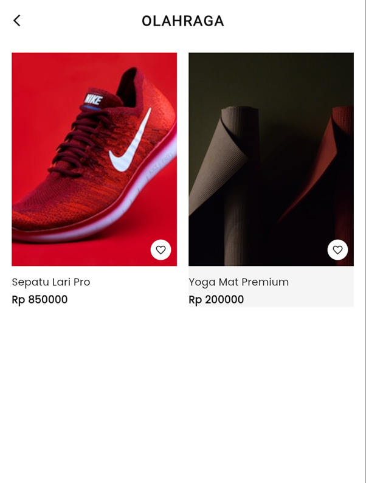

# MyShop Mini

Aplikasi ini dibuat untuk memenuhi tugas **UTS Pemrograman Mobile**.

## Identitas Mahasiswa
*   **Nama**: Riski Putra Alamzah
*   **NIM**: 221080200100
*   **Mata Kuliah**: Pemrograman Mobile
*   **Semester**: 7

## Preview Aplikasi
Berikut adalah tampilan antarmuka aplikasi **MyShop Mini**:

| Home Screen | Product List | Product Detail |
|:-----------:|:------------:|:--------------:|
|  |  |  |
| *Tampilan Utama* | *Daftar Produk* | *Detail Produk* |

> **Catatan**: Simpan screenshot aplikasi Anda di dalam folder `screenshots` dengan nama file `home.png`, `list.png`, dan `detail.png`.

## Deskripsi Proyek
**MyShop Mini** adalah aplikasi *e-commerce* sederhana berbasis Flutter yang dirancang dengan antarmuka modern ala *high-fashion* (inspirasi Zalora). Aplikasi ini memiliki alur navigasi yang intuitif dan tampilan visual yang menarik.

## Fitur Utama
1.  **Home Screen**:
    *   Menampilkan *Hero Banner* dengan efek *Glassmorphism*.
    *   Daftar kategori produk (Wanita, Pria, Olahraga, dll) dalam bentuk kartu visual.
    *   Fitur "View All Categories" dengan *Modal Bottom Sheet*.
2.  **Product List Screen**:
    *   Menampilkan daftar produk berdasarkan kategori yang dipilih.
    *   Layout *Grid* 2 kolom dengan tampilan kartu produk yang elegan.
3.  **Product Detail Screen**:
    *   Detail produk dengan gambar *full-screen*.
    *   Informasi nama, harga, dan deskripsi produk.
    *   Tombol interaktif "Add to Bag".

## Desain & Teknologi
*   **Framework**: Flutter
*   **Bahasa**: Dart
*   **Style**: Minimalist, Black & White Theme (Zalora Style), Glassmorphism.
*   **Interaktivitas**: Simulasi fitur dengan *SnackBar* feedback.

## Cara Menjalankan
1.  Pastikan Flutter SDK sudah terinstal.
2.  Jalankan perintah berikut di terminal:
    ```bash
    flutter pub get
    flutter run
    ```
